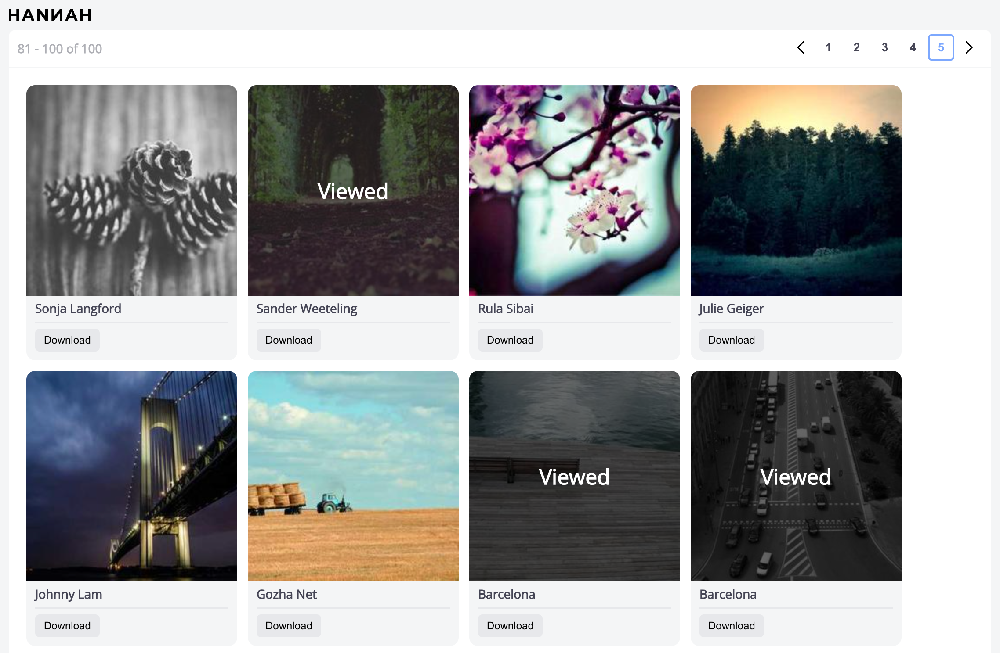
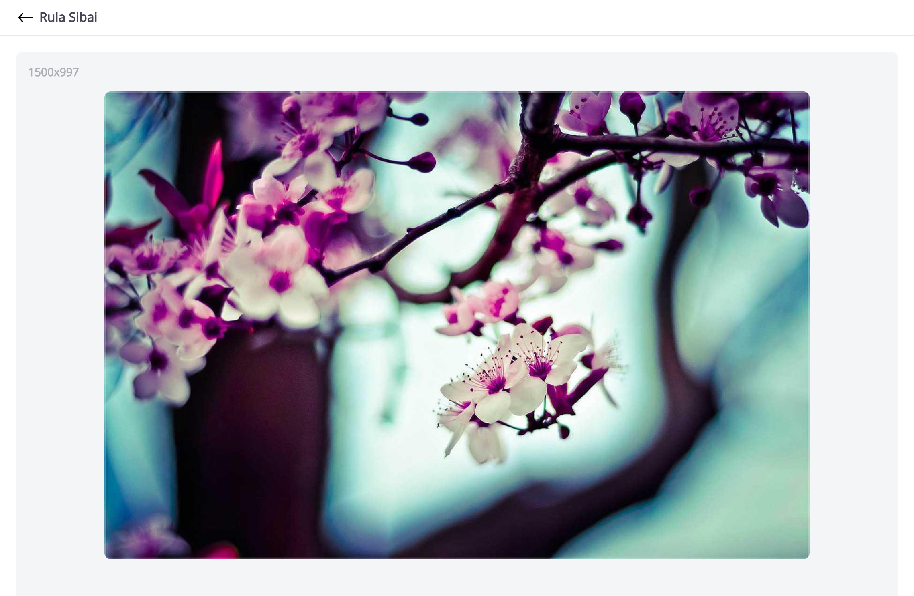

# Simple Image Gallery

Simple image gallery made with Vue.js and Typescript.


## Project setup

```
npm install
```

### Compiles and hot-reloads for development

```
npm run serve
```

### Compiles and minifies for production

```
npm run build
```

### Lints and fixes files

```
npm run lint
```

### Run unit tests

```
npm run test:unit
```
## Building and Running the Docker Image
Follow these steps to build and run the Dockerized Simple Image Gallery application.

### Step 1: Build the Docker Image

Run the following command to build the Docker image:

```
docker build -t simple-image-gallery .
```

### Step 2: Run the Docker Container

After the image is built, you can run it using:

```
docker run -d -p 8080:80 simple-image-gallery
```

### Step 3: Access the Application

Open a browser and navigate to:
```
http://localhost:8080
```

## Usage
Click on gallery item image for details. Use left and right arrow keys to navigate to previous or next image when in details view.

## Screenshots


